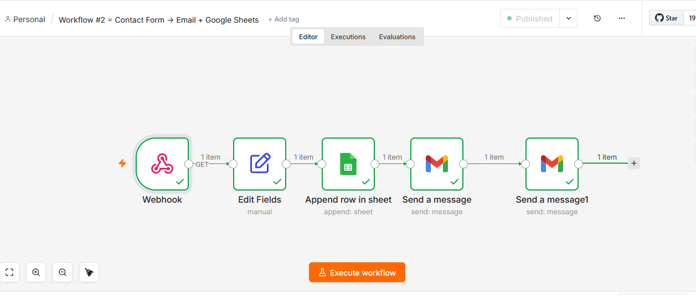

# 📬 Contact Form → Email + Google Sheets — n8n Automation

## What This Does

I built this because I kept seeing the same problem.

Business owners had contact forms on their websites.
People filled them out every day.
But nobody was following up.

Not because they didn't care.
Because nobody told them a lead just arrived.

So I automated the whole thing.

Now when someone fills your contact form,
three things happen instantly — without you touching anything:

- Their details get saved to your Google Sheet automatically
- You get an instant email saying a new lead arrived
- They get a friendly reply confirming you received their message

You focus on your business.
The automation handles the rest.

---

## The Problem I Solved

Let me be real with you.

A contact form without automation is just a dead inbox.

Someone fills the form.
The data goes nowhere.
No record. No notification. No reply.

They wait.
You don't know they contacted you.
They move on to your competitor.

I have seen this happen to coaches, consultants,
shop owners, freelancers — all kinds of businesses.

Every missed form submission is a missed opportunity.
Every missed opportunity is lost money.

This workflow makes sure that never happens again.

---

## How It Works

No coding. No complicated setup.
Just a clean simple system that works every time.

Step 1 — Someone fills your contact form
Name. Email. Message. Submitted.

Step 2 — Webhook catches the data instantly
The moment they hit submit,
n8n wakes up and starts working.

Step 3 — Data gets cleaned and organised
Name. Email. Message. All extracted neatly.

Step 4 — Everything saves to Google Sheets
One new row. Automatically.
Every lead. Every time.

Step 5 — You get an email notification
"New lead just arrived!"
Name. Email. Message. Right in your inbox.

Step 6 — Customer gets an auto reply
"We received your message!"
They feel heard. They trust you. They wait.

The whole process takes less than 3 seconds.
Every single time.

---

## Workflow Screenshot



---

## Flow Diagram

```
Contact Form Submitted
        ↓
Webhook Catches Data
        ↓
Extract Name + Email + Message
        ↓
Save to Google Sheets
        ↓
Send Email to Business Owner
        ↓
Send Auto Reply to Customer
        ↓
Done ✅
```

---

## The Nodes I Used

### Node 1 — Webhook
This is the entry point.
It sits and waits for form submissions 24/7.
The moment someone submits the form,
this node catches everything and passes it forward.

### Node 2 — Edit Fields
Cleans the raw data.
Picks out exactly what matters:
- Name — who contacted you
- Email — how to reach them
- Message — what they need

### Node 3 — Google Sheets (Append Row)
Saves every lead to your spreadsheet automatically.
Every submission = one new row.
Open your sheet anytime and see every lead ever received.

### Node 4 — Gmail (Send to Owner)
Sends you an instant notification email.
You know the moment a lead arrives.
No checking. No waiting. Just instant awareness.

### Node 5 — Gmail (Auto Reply to Customer)
Sends the customer a friendly confirmation.
They know their message arrived.
They trust you. They stay. They wait for your reply.

---

## Google Sheet Structure

| name | email | message | date |
|------|-------|---------|------|
| Sarah | sarah@email.com | I need help | 2026-06-04 |
| Ahmed | ahmed@email.com | What is your price? | 2026-06-04 |
| John | john@email.com | Are you available? | 2026-06-04 |

---

## Who Needs This

- Business owners with contact forms getting no follow up
- Coaches and consultants missing client inquiries
- Freelancers too busy to monitor their inbox
- E-commerce stores needing instant customer replies
- Anyone who has ever missed a form submission

---

## Real Questions From Real Buyers

**Will I miss any form submissions?**
No. Webhook runs 24/7 on the cloud.
Every submission gets caught. Every time.

**Where are leads saved?**
In your own Google Sheet.
Your data. Your account. Your control.

**Can I change the email messages?**
Yes. One click. 30 seconds.

**Does this work with any contact form?**
Yes. Any form that can send a POST request.
Tally, Typeform, Webflow, custom HTML forms — all work.

**Do I need coding knowledge?**
Zero. Completely no code.

**How long does setup take?**
Under 20 minutes.

**Is this a one time setup?**
Yes. Set it up once. It runs forever.

---

## Download & Import Workflow

1. Download json
2. Open n8n
3. Click Import Workflow
4. Upload the JSON file
5. Add your Gmail and Google Sheets credentials
6. Publish and you are live

---

## What I Built This With

- n8n — workflow automation (free at n8n.io)
- Webhook — catches form submissions
- Google Sheets API — completely free
- Gmail API — completely free

This entire workflow runs without spending a single dollar.

---

## 💰 Hire Me — Pricing

I do not just send you a JSON file.
I set everything up for your business.
Your form. Your email. Your Google Sheet.
Tested. Live. Working.

| Package | Price | What You Get |
|---------|-------|-------------|
| **Basic** | $30 | Full workflow setup + Google Sheet + tested + live |
| **Standard** | $50 | Everything in Basic + custom email messages + 3 days support |
| **Premium** | $80 | Everything in Standard + 2 extra changes + 7 days support + video walkthrough |

---

## Why Work With Me

I show my full work right here on GitHub.
Every node. Every step. Every decision.
You can see exactly how I build before you spend a single dollar.

No surprises. No hidden steps. No confusion.
Just clean working automation delivered professionally.

---

## Ready To Get Started?

Message me on Fiverr or Upwork.
Tell me about your business.
I will tell you exactly how I can help.

Response time: under 2 hours.

I look forward to working with you.
